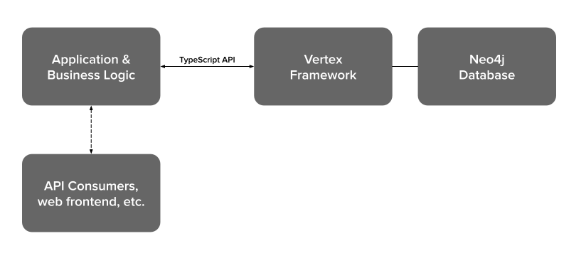
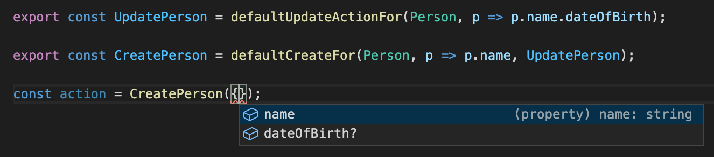
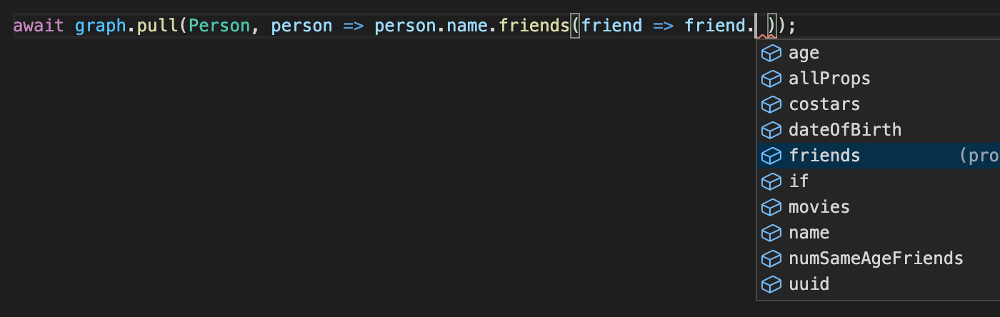
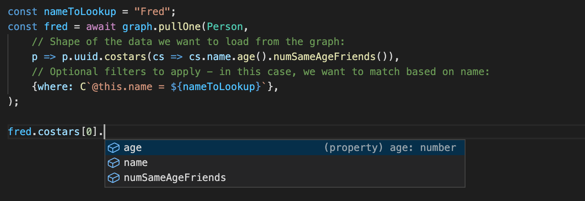
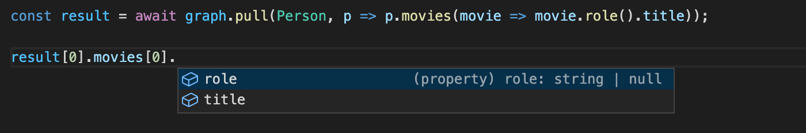

# Vertex Framework

Vertex Framework is an **experimental** graph data management framework in active development for use by the [TechNotes](https://technotes.org) prototype. It sits between a TypeScript application and a Neo4j graph database.



Its design choices are oriented around the TechNotes use case and probably not suitable for general use at this time.

🚧 **Vertex Framework is pre-alpha and unstable.** Its API will feature regular breaking changes. 🚧

---

Here are some of the features that Vertex Framework provides:

## Data traceability (Actions)

Have you ever been debugging a web application and wondered how some data value got into your database? (Who changed this setting / how did this entry get created / etc.). With Vertex Framework, that question is always easy to answer. While *reading* from the database is completely unrestricted, *writing* to the database is only possible via **Actions**.

An **`Action`** represents a change to the database, such as "Create User", "Update User Profile", "Edit Article", and so on. (Actions are similar to GraphQL "Mutations", and are also "Commands" in the more general [Command Pattern](https://en.wikipedia.org/wiki/Command_pattern).) When an `Action` is run, data about the Action itself is saved into the graph, such as what user ran the action, when the action ran, how long it took to process, and what nodes it modified. This means that it's trivial to look up an ordered list of actions that have modified any given node in the graph, giving the complete change history of that node.

Vertex Framework uses APOC triggers to enforce this constraint, i.e. to ensure that the database cannot be modified other than through Actions, and that Actions must always indicate which nodes they have modified.

Actions can optionally define how to "invert" their effects, which gives the ability to "undo" actions where useful.

## Data integrity and schema

Neo4j has relatively minimal support for enforcing schema constraints. Vertex Framework implements a layer of schema definition and validation on top of Neo4j, providing your application with all the benefits that strongly typed data brings.

Every node in your data graph that Vertex Framework manages is called a `VNode` and must comply with one or more VNode types defined by your application. All `VNode`s have the `:VNode` label and at least one other label, as well as a `UUID` as their primary key.

Here is an example of how an application can define a `VNode` type and its schema:

```typescript

/**
 * A Person VNode type
 */
@VNodeType.declare
export class Person extends VNodeType {
    static label = "Person";
    static properties = {
        ...VNodeType.properties,
        name: Joi.string().required(),
        dateOfBirth: Joi.date().iso(),
    };
    static rel = VNodeType.hasRelationshipsFromThisTo({
        /** This Person acted in a given movie */
        ACTED_IN: {
            to: [Movie],
            properties: {
                role: Joi.string(),
            },
        },
        /** This Person is a friend of the given person (non-directed relationship) */
        FRIEND_OF: {
            to: [Person],
            properties: {},
            cardinality: VNodeType.Rel.ToManyUnique,
        },
    });
    static defaultOrderBy = "@this.name";
}

```

The type and validation rules of each property are defined using [Joi](https://joi.dev/).

When any `Action` creates or modifies a VNode with the `Person` label, Vertex framework will validate this schema. If the Action created a `Person` VNode that was missing the required `name` property, or that had a `FRIEND_OF` relationship pointing to a `Movie` VNode, or any other schema violation, the `Action` will fail validation and its transaction will not be committed.

## Auto-generated Actions

Nobody likes boilerplate. Vertex Framework can auto-generate Actions for common CRUD operations and provides helpers functions that make it easy to write custom actions that modify properties and relationships.

For example, to create `CreatePerson` and `UpdatePerson` actions for the `Person` VNode type shown above, the code needed is simply:

```typescript
export const UpdatePerson = defaultUpdateActionFor(Person, p => p.name.dateOfBirth);

export const CreatePerson = defaultCreateFor(Person, p => p.name, UpdatePerson);
```

In the first line, `p.name.dateOfBirth` is specifying which `Person` fields the auto-generated `UpdatePerson` action should be able to update. It's fully typed, so as you type `p => p.` in your IDE, you'll get a dropdown showing you the available fields, and if you refactor your `Person` schema but still reference an old field here, TypeScript will show an error. In the second line, `p => p.name` is speciyfing that the `name` property is required and must be specified when running the `CreatePerson` action. Other properties defined in the `UpdatePerson` action can also be passed in, but will be optional:



Auto-generated actions like this can always be "inverted", providing out of the box "undo" functionality.

## Cypher syntactic sugar

Whether you're writing actions to modify the database or just queries to read data from the database, you'll be enjoying the power and flexibility of Cypher. While you can of course use "plain" Cypher and the regular Neo4j JavaScript API, Vertex Framework provides a lot of syntactic sugar that makes it simpler to write queries, helps you avoid typos, and provides fully typed data.

Here is a query using "plain" Cypher:

```typescript
const firstMovieTitle = await graph.read(async tx => {

    const result = await tx.run(`
        MATCH (p:Person:VNode {uuid: $uuid})
        MATCH (p)-[:ACTED_IN]->(m:Movie:VNode)
        RETURN m
    `, {
        uuid: personId,
    });

    return result.records[0].get("m").title;
});
// Type of "firstMovieTitle" is now "any"
```

And here is the same query using the optional syntactic sugar:

```typescript
const firstMovieTitle = await graph.read(async tx => {

    const result = await tx.query(C`
        MATCH (p:${Person} {uuid: ${personId}})
        MATCH (p)-[:${Person.rel.ACTED_IN}]->(m:${Movie})
    `.RETURN({m: Movie}));

    return result[0].m.title;
});
// Type of "firstMovieTitle" is now "string"
```

This second example shows:

* TypeScript knows what fields are available on the returned `m` record, and the types of each, such as the `title` field which is a `string`.
* Variables like `personId` can be interpolated directly into the query - there's no need to define a neo4j parameter variable like `$uuid` and then pass a separate object with parameter values. You can rest assured that the data values are still passed as parameters though, ensuring that query plans can be re-used and your application is safe against Cypher injection attacks.
* Instead of hard-coding labels and relationship types, you can interpolate a `VNode` type and its relationship definitions. The syntactic sugar code knows that these are labels, not parameters, and will replace `:${Person}` with the correct `:Person:VNode` label, and similar for relationships.
  * This has the advantage that if you make any typo or reference a relationship that has been renamed, etc., TypeScript will immediately highlight your error, making query writing and refactoring easier.
  * If you're wondering why `:${Person}` gets replaced with both `:Person` and `:VNode` labels, that is required since only `:VNode` has an index on UUIDs, and Vertex Framework handles data "deletion" by keep data around but removing the `:VNode` label.)

For complex custom queries, `.givesShape` can be used to specify arbitrary return types that TypeScript will be aware of, though the syntax is a little more verbose:

```typescript
const result = await tx.query(C`
    MATCH (p:${Person} {uuid: ${personUuid}})
    MATCH (p)-[rel:${Person.rel.ACTED_IN}]->(m:${Movie})
    RETURN {title: m.title, role: rel.role} AS movie
`.givesShape({
    movie: {map: {title: "string", role: "string"}},
}));
// Type of "result" is Array<{movie: {title: string; role: string;}}>
```

## Virtual properties, derived properties, and data pulls

Of course, we don't want to have to write a Cypher query every time we need some piece of data from the graph. Vertex Framework provides some additional features to make your life easy when reading VNode data.

First, when defining a `VNode` type/schema, you can also specify **virtual properties** and **derived properties**, like this:

```typescript

/**
 * A Person VNode type
 */
@VNodeType.declare
export class Person extends VNodeType {

    ... // label, properties, rel, defaultOrderBy as shown above

    static virtualProperties = VNodeType.hasVirtualProperties({
        // The movies that this person has acted in:
        movies: {
            type: VirtualPropType.ManyRelationship,
            query: C`(@this)-[@rel:${Person.rel.ACTED_IN}]->(@target:${Movie})`,
            relationship: Person.rel.ACTED_IN,
            target: Movie,
        },
        // Costars: people who have acted in the same movies as this person:
        costars: {
            type: VirtualPropType.ManyRelationship,
            query: C`(@this)-[:${Person.rel.ACTED_IN}]->(:${Movie})<-[:${Person.rel.ACTED_IN}]-(@target:${Person})`,
            target: Person,
        },
        // Friends of this person:
        friends: {
            type: VirtualPropType.ManyRelationship,
            query: C`(@this)-[:${Person.rel.FRIEND_OF}]-(@target:${Person})`,
            target: Person,
        },
        // Compute this person's age (using Cypher)
        age: {
            type: VirtualPropType.CypherExpression,
            cypherExpression: C`duration.between(date(@this.dateOfBirth), date()).years`,
            valueType: "number" as const,
        }
    });

    static derivedProperties = VNodeType.hasDerivedProperties({
        numSameAgeFriends,
    });
}

/**
 * A "derived property" that computes the number of this person's friends that are the same age.
 * This computation happens in JavaScript, not Cypher.
 */
function numSameAgeFriends(): DerivedProperty<number> { return DerivedProperty.make(
    // What VNodeType this derived property works for:
    Person,
    // Dependencies: Define what data this derived property needs:
    p => p.age().friends(f => f.age()),
    // Computation: how to compute the value of this derived property for each Person:
    p => {
        // TypeScript knows that the type of "p" here is:
        // p: { age: number; friends: ({ age: number; })[]; }
        return p.friends.filter(f => f.age === p.age).length;
    }
)}

```

**Virtual properties** as shown above can represent relationships to other nodes (either -to-many or -to-one relationships), or Cypher expressions such as the `age` virtual property shown in this example. Virtual properties are defined using Cypher expressions, with the special placeholder variables `@this`, `@rel`, and `@target` available to specify the current node, a relationship used in the result, and the target node respectively.

**Derived properties** are like virtual properties but are computed by Vertex Framework after data has been fetched from the database, before returning it to your application. Each derived property can define dependencies, i.e. regular properties and/or virtual properties that it needs to compute its value. Each derived property also defines a computation function that uses the data retrieved from the database to compute its value. In the example shown above, the `numSameAgeFriends` derived property declares a dependency on the person's `age` as well as the person's list of friends and the age of each friend. It then uses that data to produce a `number` typed result.

### Reading data from the graph

With regular ("raw"), virtual, and derived properties all defined in the VNode type definition, your application can now use the `pull()` and `pullOne()` methods to read data from the database, while specifying the exact data shape you'd like. This works similarly to a GraphQL query but is fully integrated into TypeScript, with no need for code generation.

Examples:

As you type out a call to `pull()`, your IDE will prompt you with available properties:



A complete call to `pull()`, to look up a specific person and information about their costars looks like this:



As you can see, everything is fully typed and TypeScript is aware of all available fields and the exact shape of the data returned by the query.

The syntax of specifying properties with `pull()` and anywhere else in vertex framework is that regular ("raw") properties are just chained like `person.name.dateOfBirth.uuid`, but virtual and derived properties are chained as method calls like `person.age().numSameAgeFriends()`. If the virtual property is a relationship, then it's necessary to pass in parameters to determine the shape of data you want from the target VNode type as well (e.g. `p.friends(f => f.name)` to specify that the name of each friend is to be loaded.)

`pull()` and `pullOne()` are nearly identical, but `pull()` always returns an array and `pullOne()` always returns a single result (and throws an error if the query returns anything other than a single result).

A note on **design goals for pull()**: pull() is designed to make common data retrieval cases easy, consistent, centrally defined (in the VNode model), and fully typed, but it is not designed as a complete replacement for Cypher. For any very complex lookups or features that pull() doesn't support, just use Cypher directly, along with all the other syntactic sugar and typing support that Vertex Framework provides.

## Projected virtual properties

If your VNode type defines properties in its relationship schema, and then references that relationship in a virtual property:

```typescript
    static rel = VNodeType.hasRelationshipsFromThisTo({
        ...
        ACTED_IN: {
            to: [Movie],
            properties: {
                // Properties stored on the relationship:
                role: Joi.string(),
            },
        },
    ...
    static virtualProperties = VNodeType.hasVirtualProperties({
        ...
        movies: {
            type: VirtualPropType.ManyRelationship,
            target: Movie,
            query: C`(@this)-[@rel:${Person.rel.ACTED_IN}]->(@target:${Movie})`,
            //                ^^^^ special relationship variable
            relationship: Person.rel.ACTED_IN,
        },
```

Then when you call pull() via that virtual relationship (`movies` in this example), any properties from the relationship will be "projected" onto the target VNode and available for you to use. So in this case, the `role` string property will appear on the target `Movie` VNodes, although it's coming from the relationship and is not a property of the `Movie` VNode:



## Conditional Properties

If you're designing an API and you want to include some data in the result that is expensive to compute, you might want to make it optional, so that clients can choose whether or not they need that data. Vertex Framework makes this easy, with built in support for conditionally retrieving properties based on **flags**.

Here's an example:

```typescript
const flags = request.GET["flags"]?.split(",") || [];

const result = await graph.pull(Person, p => p
    .uuid
    .name
    .dateOfBirth
    .if("includeFriends", p => p
        .friends(f => f.uuid.name.dateOfBirth)
        .numSameAgeFriends()
    ),
    {flags,}
);
```

With that example, each entry in the result array will have optional `friends` and `numSameAgeFriends` properties, which may or may not be available at runtime depending on whether or not `?flags=includeFriends` was specified by the request.

Conditional properties are designed to partially provide one of the big features of GraphQL - that API clients can specify which fields they need - in a REST API, while also ensuring that the application has full control over what queries are allowed and what data can be returned.

## ShortIds

Vertex Framework requires that every VNode has a `uuid` primary key. Optionally, some VNode types can have a "secondary key" by defining a property called `shortId` and setting its type to `ShortIdProperty`. A short ID is a string between 1 and 32 characters long used as a changeable identifier for that VNode. For example, a person named Alex might have the shortId `p-alex`.

Unlike the primary key, the `shortId` of a given VNode can be changed when needed. However, Vertex Framework ensures that even though shortIds can be changed, "old" shortIds will continue to work and to "point to" the same VNode. This allows you to use shortIds in URLs, confident that even if the shortId is changed at some point, the URL will continue to work forever.

To support this, a special syntax is required for looking up VNodes:

```typescript
const key = "p-alex";  // Key can be a UUID or a shortId
const alex = (await graph.read(tx => tx.queryOne(C`

    MATCH (p:${Person}), p HAS KEY ${key}

`.RETURN({p: Person})))).p;
```

That is, in any `MATCH` clause, use `, nodeVariable HAS KEY ${keyVariable}` to lookup a VNode by key, where the key variable can be either a UUID or a shortId. The query will get rewritten to look up the VNode using either `MATCH (p:Person:VNode), (p:VNode {uuid: $key})` in the case of a UUID or `MATCH (p:Person:VNode), (p:VNode)<-[:IDENTIFIES]-(:ShortId {shortId: $key})`. The `ShortId` graph nodes required to make this work are automatically managed by Vertex Framework.

## Inheritance

If you define a VNode schema that uses inheritance (e.g. `Planet` is a subclass of `AstronomicalBody` is a subclass of `VNodeType`), you should find that Vertex Framework handles it well, and everything "just works".

To make this possible, you'll notice that the default Create action will give each VNode several labels: the label of its type, as well as of every inherited type. (So a `Planet` VNode would have labels `:Planet:AstronomicalBody:VNode`.) If you write your own create action, you'll need to ensure that you assign the appropriate labels from every parent class too (you'll get an error if you don't).

Also, when defining the properties, relationships, virtual properties, and derived properties of your subclass, if different from the parent class, you'll need to explicitly include the inherited ones, like this:

```typescript
    static derivedProperties = VNodeType.hasDerivedProperties({
        ...ParentClass.derivedProperties,  // <-- add this line
        numSameAgeFriends,
    });
```

## Migrations

Vertex Framework includes a rudimentary migrations framework that your application can use to modify the database schema, for example to add a unique constraint on a particular property or to do a data migration if some fields/VNode types have been renamed.

Here is an example of how to initialize Vertex Framework with a custom migration:

```typescript
import { Vertex } from "vertex-framework";
import { config } from "../app/config";

export const graph = new Vertex({
    neo4jUrl: config.neo4jUrl,
    neo4jUser: config.neo4jUser,
    neo4jPassword: config.neo4jPassword,
    extraMigrations: {
        // Users have unique email addresses:
        userEmailUnique: {
            forward: async (dbWrite) => {
                await dbWrite(async tx => {
                    await tx.run("CREATE CONSTRAINT user_email_uniq ON (u:User) ASSERT u.email IS UNIQUE");
                });
            },
            backward: async (dbWrite) => {
                await dbWrite(tx => tx.run("DROP CONSTRAINT user_email_uniq"));
            },
            dependsOn: [],
        },
    },
});
```

## Dealing with circular references

When creating a Node.js/TypeScript project, circular references can be a big pain. Often they are only detectable at runtime, resulting in strange bugs where some class in your code is unexpectedly `undefined`.

Due to Vertex Framework's design that tries to provide as much type information as possible, there will be times when circular references to `VNodeType` classes come up in your code, sometimes unavoidably. Vertex Framework has a couple of features to help reduce this pain:

* Cypher syntactic sugar will lazily evaluate interpolated classes/values as late as possible, so a reference like `` C`MATCH (p:${Person})` `` will not evaluate `Person` right away (as it be undefined during module import), but instead will wait until the query actually needs to be compiled and executed, and then evaluate it.
* Some other types of circular references will be detected at runtime and Vertex Framework will throw an exception clearly stating that the problem is most likely a circular reference.

If you have an unavoidable circular reference, Vertex Framework provides a simple tool for solving the problem: **forward references** to VNodeTypes. For example, say you have a `Movie` VNodeType which has a -to-one relationship to `MovieFranchise`. You want `Movie` to have a `.franchise` virtual property to get the movie's franchise, but you also want the `MovieFranchise` VNodeType to have a `.movies` property to get the movies in that franchise. Here's how you can define both VNodeTypes using a forward reference:

In `Movie.ts`:

```typescript
import { VNodeType, VNodeTypeRef } from "vertex-framework";

// Declare a forward reference to Movie _before_ importing MovieFranchise.
// Specify the type (typeof Movie) for TypeScript and the label ("Movie") for
// Vertex Framework to use to find the full class definition at runtime.
export const MovieRef: typeof Movie = VNodeTypeRef("Movie");

import { MovieFranchise } from "./MovieFranchise";

// Define Movie now:
@VNodeType.declare
export class Movie extends VNodeType {
    static label = "Movie";
    ...
    static rel = VNodeType.hasRelationshipsFromThisTo({
        /** This Movie is part of a franchise */
        FRANCHISE_IS: {
            to: [MovieFranchise],
            properties: {},
            cardinality: VNodeType.Rel.ToOneOrNone,
        },
    });
    static virtualProperties = VNodeType.hasVirtualProperties({
        franchise: {
            type: VirtualPropType.OneRelationship,
            query: C`(@this)-[:${Movie.rel.FRANCHISE_IS}]->(@target:${MovieFranchise})`,
            target: MovieFranchise,
        },
    });
}
```

Then, in `MovieFranchise.ts`:

```typescript
// Instead of importing Movie, which would cause a circular reference,
// we import MovieRef:
import { MovieRef as Movie } from "./Movie";

@VNodeType.declare
export class MovieFranchise extends VNodeType {
    static label = "MovieFranchise";
    ...
    static virtualProperties = VNodeType.hasVirtualProperties({
        movies: {
            type: VirtualPropType.ManyRelationship,
            query: C`(@this)<-[:${Movie.rel.FRANCHISE_IS}]-(@target:${Movie})`,
            target: Movie,
        },
    });
}
```

You should then generally be able to use `MovieRef` anywhere you would use `Movie`; behind the scenes, `MovieRef` is created as an ES6 `Proxy` object, which becomes a proxy for the real `Movie` class.

---

## Roadmap

Future improvements planned for Vertex Framework:

* Full data types when declaring VNode properties; keep Joi for validation only (e.g. currently TypeScript doesn't know when a Joi.string() is required or nullable, which creates suboptimal types; currently there is no "date" or "datetime" or "bigint" support)
* Pagination of results when using `pull()`
* Pagination and filtering of -to-many virtual properties when using `pull()`
* A mechanism for actions that have side effects
* "Standard" virtual properties like "DateCreated", "ChangeHistory", etc. available on all VNodes
* "Preview" transactions: open a non-committable transaction (that doesn't take write locks) so that the database can be queried as if some action(s) were applied, to preview and validate their effects without committing them.

## License

MIT

## Contributing

If you're interested in this project, contributions and help are welcome! Please feel fre to open a GitHub issue or pull request, or to reach out to Braden at braden@technotes.org.
